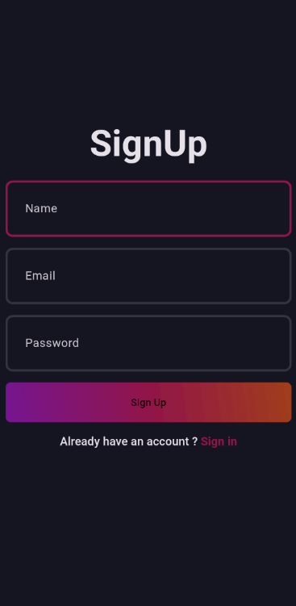
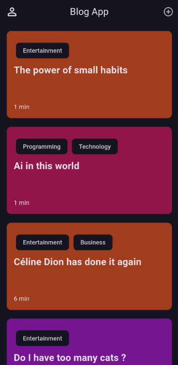
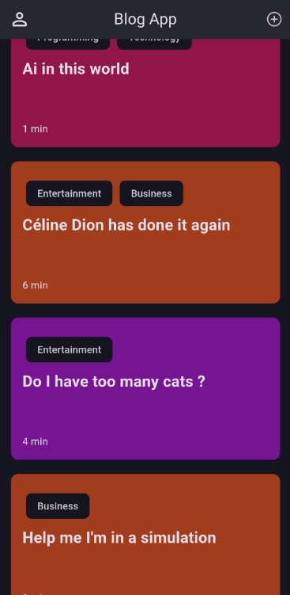

# Blog App Screenshots

<table>
  <tr>
    <td>
      
    </td>
    <td>
      <b>Login View:</b> This screen allows users to log into their accounts with their credentials.
    </td>
  </tr>
  <tr>
    <td>
      
    </td>
    <td>
      <b>Sign Up View:</b> This screen enables new users to create an account by filling out the registration form.
    </td>
  </tr>
  <tr>
    <td>
      
    </td>
    <td>
      <b>Blogs View:</b> A list of blogs that users can browse, read, and interact with.
    </td>
  </tr>
  <tr>
    <td>
      
    </td>
    <td>
      <b>Menu View:</b> A navigation menu that allows users to access different sections of the app.
    </td>
  </tr>
</table>

