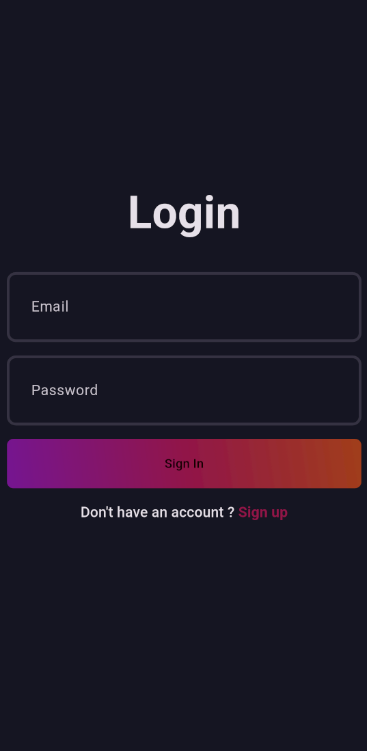

# Blog App Screenshots

<table>
  <tr>
    <td>
      
    </td>
    <td>
      <b>Login View:</b>
      

        The login screen allows users to securely authenticate using their credentials. This feature is powered by 
        <b>Firebase Authentication</b>, ensuring robust security and ease of implementation. 
        The login logic follows a <b>clean architecture</b> pattern, separating UI, business logic, and data layers. 
        State management for user authentication is handled using the <b>BLoC (Business Logic Component)</b> pattern, 
        ensuring a reactive and testable implementation.
      

    </td>
  </tr>
  <tr>
    <td>
      
    </td>
    <td>
<b>Sign Up View:</b>
      

        The sign-up screen enables new users to register by providing necessary details like email and password. 
        <b>Firebase Authentication</b> is used for creating new user accounts and storing them in a secure backend. 
        Validation is performed on the client side, and the BLoC state management ensures smooth user experience with 
        real-time error handling. Clean architecture principles keep the code maintainable and scalable.
      
    </td>
  </tr>
  <tr>
    <td>
      
    </td>
    <td>
<b>Blogs View:</b>
      

        This screen displays a list of blogs fetched dynamically from a backend service. The data is retrieved from 
        <b>Firebase Firestore</b>, and caching is implemented to improve performance. 
        The BLoC pattern is utilized to manage states like loading, success, and error, providing a responsive UI. 
        Each blog entry is displayed in a structured card format, adhering to clean architecture principles for data flow.
      
    </td>
  </tr>
  <tr>
    <td>
      
    </td>
    <td>
<b>Menu View:</b>
      

        The menu screen serves as a navigation hub for the app, giving users access to various features like profile management, 
        settings, and logout. It leverages the <b>Drawer Widget</b> in Flutter for a modern and intuitive design. 
        The menu options dynamically adapt based on the user's authentication state, managed through BLoC. 
        Clean architecture ensures that navigation logic is decoupled from the UI, enhancing testability.
      
    </td>
  </tr>
</table>

